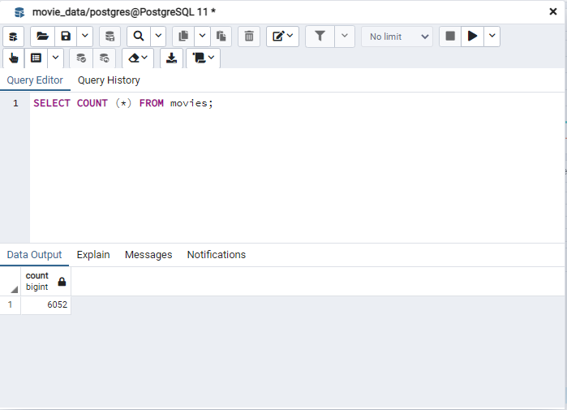
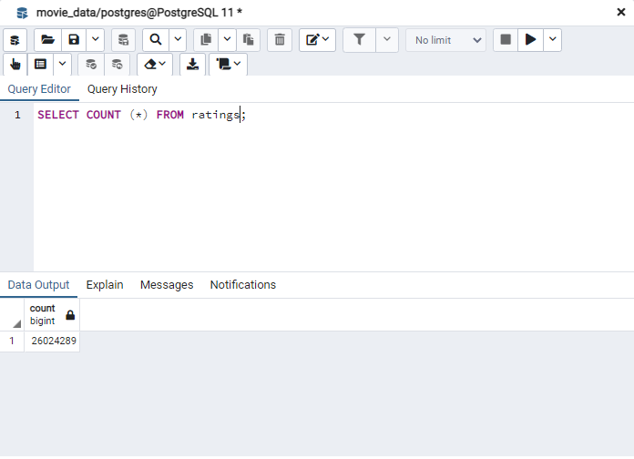

# Movies-ETL
Module 8

## Overview and Objectives
The objective of this project was to develop an automated pipeline of data from Wikipedia and Kaggle (inclucing MovieLens ratings) into a PostgreSQL database for further analysis. This was done by extacting, transforming, and loading (ETL) the data from the disparate sources to present the information in a single output format. The four deliverables for this project were:
1. Write an ETL Function to Read Three Data Files
2. Extract and Transform the Wikipedia Data
3. Extract and Transform the Kaggle Data
4. Create the Movie Database

## Results
### Write an ETL Function to Read Three Data Files
The first deliverable required the development of a function to read the three data file and translate those files into three separate Pandas DataFrames using Python within Jupyter Notebook.

### Extract and Transform the Wikipedia Data
The second deliverable required an expansion of the work from the first deliverable to extract and transform the Wikipedia data in a fashion that would be ready for merging with the Kaggle data once extracted. Specifically, this enatiled removing TV shows, merging data that was redundant in multiple columns, and removing data columns where most entries were empty (null data).

### Extract and Transform the Kaggle Data
The third deliverable again built upon the code developed in the previous two so that the Kaggle data could be appropriately cleaned and formatted for appropriate integration with the Wikipedia data. This involved removing adult films (most of which had poor quality data) as well as converting data types where appropriate. Post-merge with the Wikipedia data, similar columns from each data source were evaluated for optimal selection and merged where necessary to ensure maximal population of data. Once complete, the ratings data was merged as well for each movie.

### Create the Movie Database
The final deliverable required the conversion of the data developed in Deliverable 3 to a PostgreSQL database with all merged data from our three sources.

## Conclusions
- In the merged SQL database, we could confirm that 6,052 movies were successfully incorporated.

- In the merged SQL database, we could confirm that 26,024,289 unique movie ratings were successfully incorporated.

